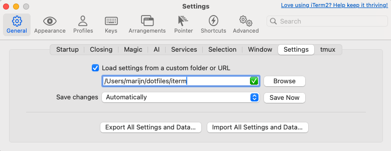
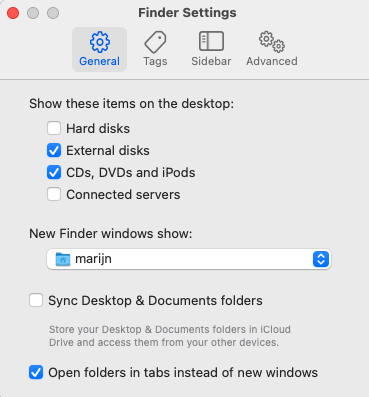
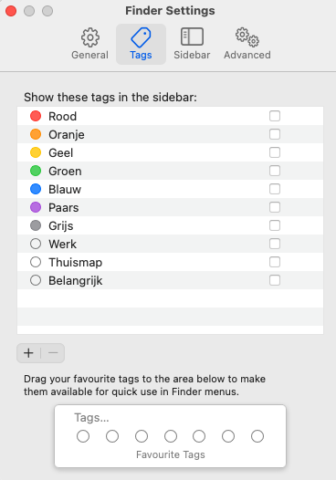
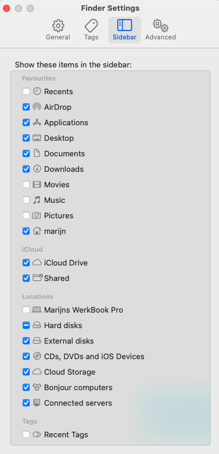
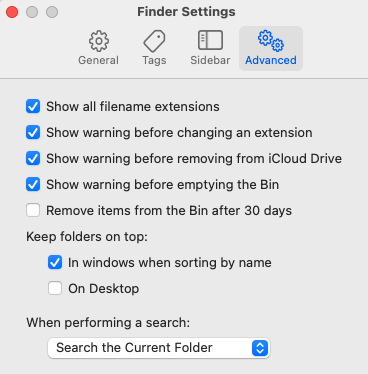

# Dotfiles
This repo contains my personal files for setting up a (new) Mac, both personal and work related things in separated files.

The order of the steps is critical to make sure everything works as expected

Inspired by [Marijke](https://marijkeluttekes.dev/) and her [dotfiles setup](https://gitlab.com/mhlut/dotfiles/)


## iTerm2
Since we are going to use this to install all other things: download and install [iTerm2 from here](https://iterm2.com/)

Make sure to set proper settings dir:



## OMZ
Oh My Zsh is a must for me, get that [from here](https://ohmyz.sh/#install)

## Powerlevel10K
Install powerlevel10K

https://github.com/romkatv/powerlevel10k?tab=readme-ov-file#oh-my-zsh

## Homebrew
Now the terminal is fixed, lets (install Homebrew)[https://brew.sh/] to install all other software

Install homebrew, update it and install all formulae and (selected)casks:
```~/dotfiles/install-homebrew.sh```

If on a personal device you can add `--personal` to add non-work casks


### Enable syncthing
Run

```brew services start syncthing``` 


### Enabling fzf

Run:

```sh
/opt/homebrew/opt/fzf/install
```

Prompt answers:

- `Do you want to enable fuzzy auto-completion? ([y]/n)` → `y`
- `Do you want to enable key bindings? ([y]/n)` → `y`
- `Do you want to update your shell configuration files? ([y]/n)` → `n`

## Setup dotfiles
Run ```~/dotfiles/setup-dotfiles.sh```

## Finder settings I like






## Random notes

Dash:
- Activate and install docsets

Dock settings:
- Show suggested and recent apps: off

NoTunes:
- Toevoegen aan startup items en dan
- `defaults write digital.twisted.noTunes replacement /Applications/Spotify.app`


